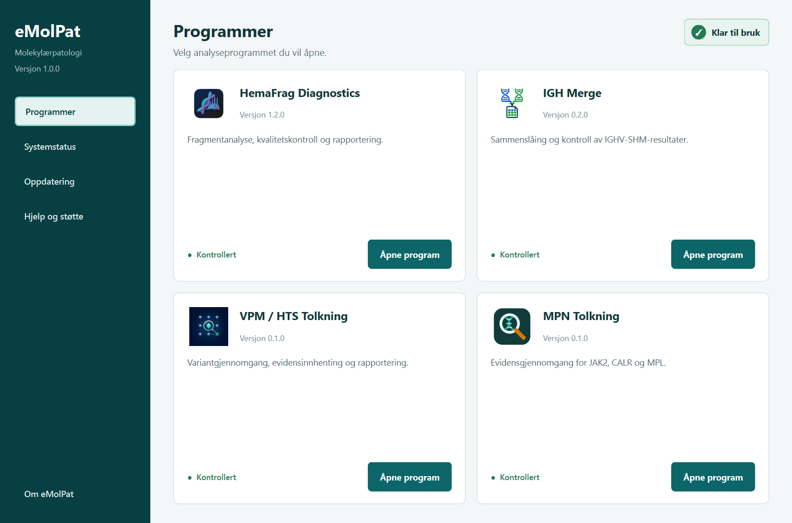
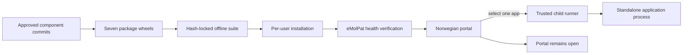

<p align="center">
  
</p>

<h1 align="center">eMolPat</h1>

<p align="center">
  One verified desktop portal for molecular pathology applications on managed Windows workstations.
</p>

<p align="center">
  
  
  
  
  
</p>

<p align="center">
  <a href="#the-suite">The suite</a> ·
  <a href="#how-it-works">How it works</a> ·
  <a href="#managed-workstation-installation">Installation</a> ·
  <a href="#safety-and-data-boundary">Safety</a> ·
  <a href="#development-and-validation">Validation</a>
</p>

<p align="center">
  <a href="https://github.com/Christian-Bjornstad/eMolPat/releases"><strong>Download eMolPat for Windows</strong></a>
</p>

Download the GitHub Release asset named `eMolPat-<version>-windows.zip`. Do **not** use **Code > Download ZIP**: that archive contains source code only and does not include the six applications or their offline dependencies.

> [!IMPORTANT]
> eMolPat is a launcher, release manager, and health boundary for controlled laboratory software. It does not perform molecular analysis itself. Patient files, clinical inputs, reports, credentials, and application settings remain owned by the individual analysis applications and are deliberately excluded from this repository.

## Overview

eMolPat packages six existing laboratory applications as one locally installed Windows suite. Laboratory staff open a single Norwegian portal, choose the required application, and continue in that application's established standalone workflow. Each application starts in a separate Python FELLES process while the portal remains open and responsive.

<p align="center">
  
</p>

| Area | Current implementation |
|---|---|
| Portal | Norwegian PyQt6 dashboard with canonical application icons |
| Applications | HemaFrag Diagnostics, IGH Merge, VPM/HTS Tolkning, MPN Tolkning, LVMS Statistikk, and MolKey |
| Launch model | Portal remains open while each approved application runs in a separate process |
| Installation | Complete offline `pip --user` installation through Python FELLES |
| Release trust | Immutable manifest, exact component commits, SHA-256 checksums, and a hashed dependency lock |
| Recovery | Health states, repair, retained-version rollback, and redacted rotating logs |
| Data handling | No clinical data is centralized, copied, uploaded, or logged by the portal |

## Why eMolPat

- **One clear starting point:** staff no longer need to remember a separate startup route for every application.
- **Existing tools stay independent:** analytical code and validated user interfaces are not rewritten or embedded.
- **One tested release:** portal, applications, and dependencies are updated as an atomic suite rather than mixed independently.
- **Workstation compatible:** installation uses the current Windows user, requires no administrator rights, and can run without internet access.
- **Visible health:** the portal distinguishes ready, update available, repair required, and unavailable states.
- **Safe failure behavior:** an application import failure returns the user to eMolPat with Norwegian guidance and a non-clinical technical log.

## The suite

| Application | Purpose | Package entry point |
|---|---|---|
| HemaFrag Diagnostics | Fragment analysis, quality control, review, and reporting | `hemafrag_diagnostics.__main__:main` |
| IGH Merge | Merge and verify IGHV-SHM results | `igh_merge.__main__:main` |
| VPM / HTS Tolkning | Variant review, evidence collection, and reporting | `archer_processor.__main__:main` |
| MPN Tolkning | Evidence review for JAK2, CALR, and MPL | `mpn_tolkning.__main__:main` |
| LVMS Statistikk | Retrieve and process activity statistics from LVMS | `lvms_stat.portal:main` |
| MolKey | Create and retrieve permanent pseudonyms in its standalone registry workflow | `molkey.__main__:main` |

Every release pins the exact Git commit, distribution name, version, import name, and official entry point for all six applications.

## How it works



An approved release contains:

```text
eMolPat-1.2.1/
├── Installer eMolPat.cmd
├── Start eMolPat.cmd
└── suite/                     Protected, verified offline payload
    ├── manifest.json
    ├── requirements.lock
    ├── packages/              Portal plus six application wheels
    ├── wheelhouse/            Exact offline Windows dependencies
    ├── install_emolpat.py
    └── start_emolpat.py
```

The manifest covers every installation artifact inside `suite`. The installer
rejects missing files, unexpected payload paths, checksum changes, unsupported
Python versions, incomplete component sets, and dependency versions outside an
application's declared contract. Operator files beside `suite` are deliberately
outside the protected payload and cannot cause a false preflight failure.

## Managed-workstation installation

The initial deployment model targets Sykehuspartner-managed Windows computers using Ivanti Workspace Control and **Python FELLES**.

1. Download `eMolPat-<version>-windows.zip` from [GitHub Releases](https://github.com/Christian-Bjornstad/eMolPat/releases).
2. Extract the complete ZIP to a normal local folder; do not run files from inside the archive.
3. Run **Installer eMolPat.cmd** from the extracted folder.
4. Ivanti opens Python FELLES and the installer copies a local Python command to the clipboard.
5. Paste with `Ctrl+V`, press Enter, and wait until all seven packages are installed and verified.
6. Run **Start eMolPat.cmd** from the same folder for normal launches.

Installation is offline, uses `pip --user`, and writes the verified suite record only after all packages and imports pass. See the [Python FELLES guide](docs/operations/python-felles.md) for the complete operator workflow and the [repair guide](docs/operations/repair.md) for controlled recovery.

### Python FELLES 3.14 release candidate

Version `1.2.1` updates LVMS Statistikk to 2.0.1 and separates the two operator
launchers from the protected suite payload. Download
`eMolPat-1.2.1-windows.zip`, extract the complete archive, and use only
**Installer eMolPat.cmd** and **Start eMolPat.cmd** from the extracted root.

This is a test prerelease and is not yet approved for routine laboratory use.
See the [1.2.1 release notes](docs/releases/1.2.1.md).

## Health and recovery

| State | Meaning |
|---|---|
| Ready | The installed suite matches a complete verified release |
| Update available | A newer approved complete release is available |
| Repair required | A package, version, import, checksum, or record is inconsistent |
| Unavailable | A required environment resource cannot be accessed |

Updates and repairs always operate on the full suite. If an update fails, eMolPat preserves the previous verified record and can reinstall a retained prior release. It never reports success until component imports and exact versions pass again.

## Safety and data boundary

eMolPat owns only non-clinical suite concerns:

- approved release metadata and checksums;
- installed versions and health results;
- application registration and launch handoff;
- bounded, redacted installation and startup logs.

eMolPat does **not** read or manage:

- patient identifiers or clinical input files;
- raw analysis data or private validation corpora;
- generated reports, evidence, screenshots, or audit material;
- application credentials, provider secrets, or module settings.

MolKey continues to own its registry, secure-drive database, pseudonym mappings,
and settings. eMolPat only verifies and starts the approved MolKey package.

Technical logs replace Windows profile paths, shared-path tails, and patient/sample-like tokens with `[redacted]`. Analysis-module arguments and clinical contents are never logged.

## Development and validation

Create a Python 3.12 development environment and run the complete local gate:

```powershell
py -3.12 -m pip install -e ".[dev]"
$env:QT_QPA_PLATFORM="offscreen"
py -3.12 -m pytest -q
py -3.12 -m ruff check .
```

Build and verify the atomic Windows release:

```powershell
py -3.12 scripts\build_suite.py `
  --version 1.2.1 `
  --output dist `
  --component-root C:\path\to\eMolPat-components

py -3.12 scripts\verify_suite.py dist\eMolPat-1.2.1
```

The build requires clean component trees at the exact commits in [`release/components.json`](release/components.json). It produces seven normalized package wheels, collects the checked-in hash-locked Windows dependency set, validates every active package requirement, and writes a sorted cryptographic manifest.

Current validation coverage includes manifest parsing, release integrity, health derivation, child-process lifecycle, redaction, rollback, deterministic assembly, Python FELLES launchers, offscreen UI behavior, and a synthetic end-to-end workflow. Release publication additionally requires the [managed-workstation checklist](docs/validation/release-checklist.md).

## Repository structure

```text
eMolPat/
├── src/emolpat/              Portal, health, install, launch, and logging services
├── assets/                   Public application identity assets
├── release/                  Component pins and authoritative dependency lock
├── scripts/                  Deterministic build and verification commands
├── packaging/                Python FELLES and Ivanti launchers
├── tests/                    Unit, UI, packaging, and synthetic E2E tests
├── docs/operations/          Build, installation, repair, and support procedures
├── docs/validation/          Release and laboratory sign-off checklist
└── docs/superpowers/         Approved architecture and implementation records
```

## Documentation

- [Approved suite architecture](docs/superpowers/specs/2026-08-13-emolpat-suite-design.md)
- [Implementation plan](docs/superpowers/plans/2026-08-13-emolpat-suite.md)
- [Build an approved release](docs/operations/build-release.md)
- [Install through Python FELLES](docs/operations/python-felles.md)
- [Repair the complete suite](docs/operations/repair.md)
- [Managed-workstation release checklist](docs/validation/release-checklist.md)
- [eMolPat 1.2.1 release notes](docs/releases/1.2.1.md)

## Release status

The codebase and assembled local Windows release pass the automated gates. Operational publication still requires hands-on installation and launch validation on a clean Sykehuspartner workstation through Ivanti/Python FELLES, followed by laboratory review and controlled release approval.
